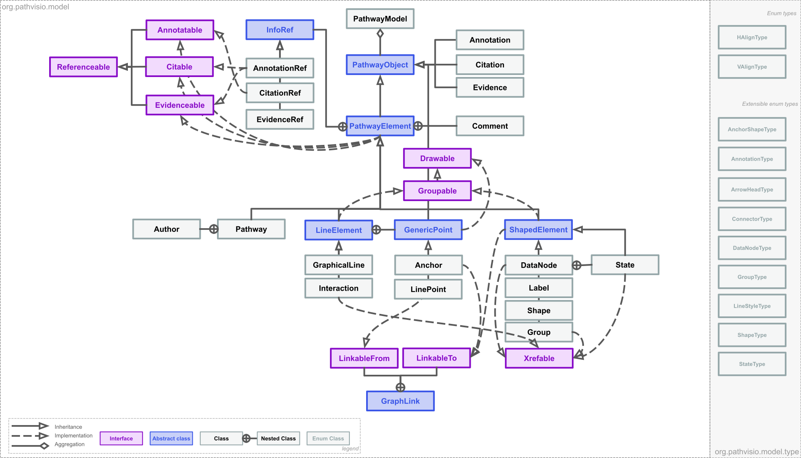

libGPML
=============================================================================

libGPML is an open-source Java library for working with [GPML (Graphical Pathway Markup Language)](https://pathvisio.github.io/documentation/GPML). 

How to cite
-----------------
If you use this software, please cite the article in JOSS:

In progress...

Table of contents
-----------------

* [Introduction](#introduction)
* [Installation](#installation)
* [Usage](#usage)
* [Getting help](#getting-help)
* [Contributing](#contributing)
* [License](#license)
* [Authors and history](#authors-and-history)
* [Acknowledgments](#authors-and-acknowledgments)

Introduction
------------

libGPML is a Java programming library that helps you read, write, validate, manipulate, and convert files and data streams in the [GPML (Graphical Pathway Markup Language)](https://pathvisio.github.io/documentation/GPML) format.  

Why not simply use a generic XML parsing library?  A specialized library such as libGPML offers many advantages over using a generic XML library directly.  Here are some:

* **Java object model**.  libGPML's object model and API are designed around GPML and the operations that are commonly needed when working with GPML.

* **Validation**. libGPML implements all the validation rules defined in the GPML specifications.

* **Conversion**: libGPML can convert between GPML2013a and GPML2021. Conversions between GPML2013a and older 

libGPML works on Linux, Windows, and  MacOS X, and other operating systems. 

Library Architecture
------------
libGPML uses an object oriented Java model. In the libGPML Java model, GPML Pathway Elements are represented by Java Classes.  Pathway Element types are represented by Enum Java Classes.

  
   
  <em>Figure 1: libGPML Java Object Model</em>

libGPML consists of several packages: 
- org.pathvisio.libgpml.debug - Debugging and logging utility classes
- org.pathvisio.libgpml.io - Import and export classes
- org.pathvisio.libgpml.model - Classes representing the pathway "model". Also includes classes for reading and writing. 
- org.pathvisio.libgpml.model.connector - Line connectors classes
- org.pathvisio.libgpml.model.shape - Shape defining classes
- org.pathvisio.libgpml.model.type - Enum type classes 
- org.pathvisio.libgpml.prop - Properties classes
- org.pathvisio.libgpml.util - Utility classes

Getting Started
------------
* [Documentation site](https://pathvisio.github.io/libGPML) 

Dependencies
------------
You need the following tools:

* Computer with Windows, Mac, or Linux
* [JDK 11](https://www.oracle.com/technetwork/java/javase/downloads/jdk11-downloads-5066655.html)
* [Maven 3](https://maven.apache.org/) (Tested with 3.8.1)

Installation
------------

Usage
-----
Please read the file [NEWS.txt](NEWS.txt) for highlights about recent changes in libGPML and important information.

Documentation is available online at [libGPML javadoc](https://pathvisio.org/libgpml-javadoc/).

Getting help
------------
You can report issues, suggestions and requests using the [GitHub issue tracker](https://github.com/libGPML/issues).  

Contributing
------------
We welcome contributions to libGPML!  Please read our [contribution guidelines](CONTRIBUTING.md), and also feel free to contact the developers to coordinate your efforts.

License
-------
libGPML is available for free under the terms of the [Apache License, Version 2.0](LICENSE).

Authors and history
---------------------------
libGPML's main authors are [Finterly Hu](https://github.com/Finterly), [Martina Summer-Kutmon](https://github.com/mkutmon), with contributions from many others.  We especially thank the following (**in alphabetical order**):
* Alex Pico
* Anders Riutta
* Chris Evelo
* Denise Slenter
* Egon Willighagen
* Friederike Ehrhart 
* Kristina Hanspers 
* Luc de Meyer
* Nhung Pham
* Susan Coort
* ... 

Acknowledgments
---------------

The development of libGPML was supported in largely by funding from WikiPathways-COVID19 ZonMW project.

 

    
  &nbsp;&nbsp;&nbsp;&nbsp;&nbsp;&nbsp;
  &nbsp;&nbsp;&nbsp;&nbsp;&nbsp;&nbsp;
    
  &nbsp;&nbsp;&nbsp;&nbsp;&nbsp;&nbsp;
  &nbsp;&nbsp;&nbsp;&nbsp;&nbsp;&nbsp;
    

