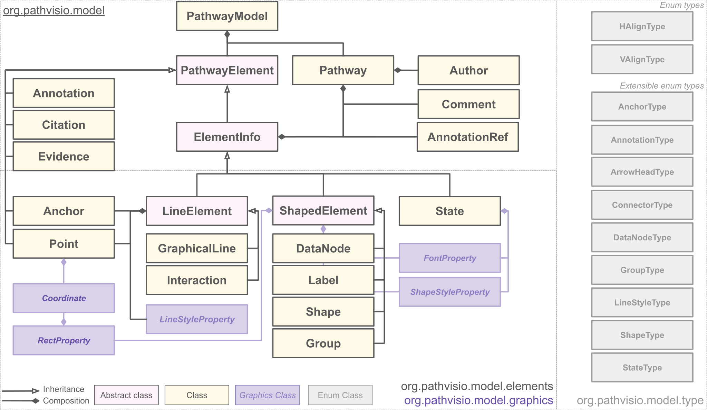
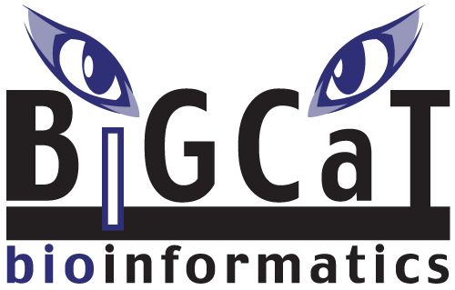

libPathVisio
=============================================================================

libPathVisio is an open-source Java library for working with GPML (Graphical Pathway Markup Language). 

Table of contents
-----------------

* [Introduction](#introduction)
* [Installation](#installation)
* [Usage](#usage)
* [Getting help](#getting-help)
* [Contributing](#contributing)
* [License](#license)
* [Authors and history](#authors-and-history)
* [Acknowledgments](#authors-and-acknowledgments)

Introduction
------------

LibPathVisio is a programming library that helps you read, write, validate, manipulate, and convert files and data streams in the [GPML (Graphical Pathway Markup Language)]() format.  

Why not simply use a generic XML parsing library?  A specialized library such as libPathVisio offers many advantages over using a generic XML library directly.  Here are some:

* **Java object model**.  libPathVisio's object model and API are designed around GPML and the operations that are commonly needed when working with GPML.

* **Validation**. libPathVisio implements all the validation rules defined in the GPML specifications.

* **Conversion**: libPathVisio can convert between GPML2013a and GPML2021. 

LibPathVisio works on Linux, Windows, and  MacOS X, and other operating systems. 

Library Architecture
------------

  

Getting Started
------------
* [Documentation site](https://pathvisio.github.io/libpathvisio) 

Dependencies
------------
You need the following tools:

* Computer with Windows, Mac, or Linux
* [JDK 11](https://www.oracle.com/technetwork/java/javase/downloads/jdk11-downloads-5066655.html)
* [Maven 3](https://maven.apache.org/) (Tested with 3.8.1)

Installation
------------

Usage
-----

Please read the file [NEWS.txt](NEWS.txt) for highlights about recent changes in libPathVisio and important information.

Documentation is available online at ....

Getting help
------------

We encourage you to join the ..... google group, where other libPathVisio users can be found.  You can ask questions and discuss the development, use, and interoperability of all kinds of software that supports GPML.

You can report issues, suggestions and requests using the [GitHub issue tracker](https://github.com/libPathVisio/issues).  

You can email the main developers directly at [@googlegroups.com](mailto: googlegroups.com).

Contributing
------------

We welcome contributions to libPathVisio!  Please read our [contribution guidelines](CONTRIBUTING.md), and also feel free to contact the developers at to coordinate your efforts.

License
-------

libPathVisio is available for free under the terms of the 

Authors and history
---------------------------

libPathVisio's main authors are [Finterly Hu](https://github.com/Finterly), [Martina Summer-Kutmon](https://github.com/mkutmon), with contributions from many others.  We especially thank the following (in alphabetical order):

* ...
* ....

Acknowledgments
---------------

The development of libPathVisio was supported in largely by funding from ...

 

  
  &nbsp;&nbsp;&nbsp;&nbsp;&nbsp;&nbsp;
  &nbsp;&nbsp;&nbsp;&nbsp;&nbsp;&nbsp;
  
  &nbsp;&nbsp;&nbsp;&nbsp;&nbsp;&nbsp;
  &nbsp;&nbsp;&nbsp;&nbsp;&nbsp;&nbsp;
  

